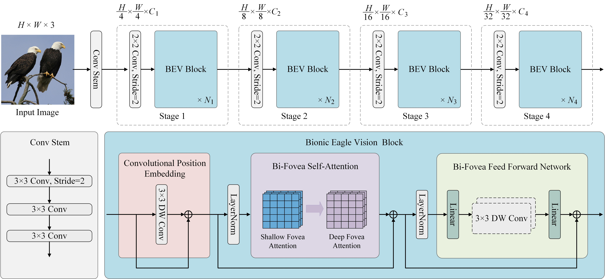

# EViT: An Eagle Vision Transformer with Bi-Fovea Self-Attention

[](https://opensource.org/licenses/Apache-2.0) 
<a href="https://pytorch.org/get-started/locally/"></a>

This is the official PyTorch implementation of [EViTs](https://arxiv.org/abs/2310.06629).

We draw inspiration from eagle vision and summarize a Bi-Fovea Visual Interaction (BFVI) structure based on the unique physiological and visual characteristics of eagle eyes. Based on this structural design approach, a novel Bi-Fovea Self-Attention (BFSA) and Bi-Fovea Feedforward Network (BFFN) are proposed. They are used to mimic how the biological visual cortex processes information hierarchically and in parallel, facilitating networks to learn feature representations of targets from coarse to fine. Furthermore, a Bionic Eagle Vision (BEV) block is designed as the basic building unit based on BFSA and BFFN. By stacking BEV blocks, a unified and efficient pyramid backbone network family called Eagle Vision Transformers (EViTs) are developed.

The overall pipeline of EViTs is illustrated in this figure.




## Installation

### Requirements

- Linux with Python ≥ 3.6
- PyTorch >= 1.8.1
- timm >= 0.3.2
- CUDA 11.1
- An NVIDIA GPU

### Conda environment setup

```bash
conda create -n EViT python=3.9
conda activate EViT

# Install Pytorch and TorchVision
pip install torch==1.13.1+cu117 torchvision==0.14.1+cu117 torchaudio==0.13.1 --extra-index-url https://download.pytorch.org/whl/cu117

pip install timm
pip install ninja
pip install tensorboard

# Install NVIDIA apex
git clone https://github.com/NVIDIA/apex
cd apex
pip install -v --disable-pip-version-check --no-cache-dir --global-option="--cpp_ext" --global-option="--cuda_ext" ./
cd ../
rm -rf apex/

# Build other environments
pip install opencv-python==4.4.0.46 termcolor==1.1.0 yacs==0.1.8
```

## Model Zoo

- EViT on ImageNet-1K

| Method     | Size | Acc@1 | #Params (M) | Download                                                                                                                                                                           |
|------------|:----:|:-----:|:-----------:|------------------------------------------------------------------------------------------------------------------------------------------------------------------------------------|
| EViT_Tiny  |  224 | 79.9  |    11.8     | 45M [[Google]](https://drive.google.com/file/d/1u9OIQULggp_x7qeMRUt8olWVmqf5eCDe/view?usp=sharing) [[BaiduNetdisk]](https://pan.baidu.com/s/1djml8EiVZpRMdA1s5h3q4A?pwd=8brp)    |
| EViT_Small |  224 | 82.6  |    24.9     | 95M [[Google]](https://drive.google.com/file/d/1D591-JBhdn7av0PK60iqOmhMRHVKwhj5/view?usp=sharing) [[BaiduNetdisk]](https://pan.baidu.com/s/1vyNdGW5YMlP7DfHRlnqf0A?pwd=drmf)   |
| EViT_Base  |  224 | 83.9  |    42.8     | 164M [[Google]](https://drive.google.com/file/d/1IthAQvhBgXVMNWZ8nwV5yRNyKnCpwXQ1/view?usp=sharing) [[BaiduNetdisk]](https://pan.baidu.com/s/1bA1kSGX5-rFJdPj309lwlg?pwd=njc2) |
| EViT_Large |  224 | 84.4  |    61.9     | 237M [[Google]](https://drive.google.com/file/d/183JMYDLCe9YNNEpOUnjGhjMzz4R90bT-/view?usp=sharing) [[BaiduNetdisk]](https://pan.baidu.com/s/1lNJAGeAxqOhVueVR71cv4Q?pwd=dth2)  |

## Evaluation
To evaluate a pre-trained EViT-Tiny on ImageNet val with a single GPU run:
```
python -m torch.distributed.run --nproc_per_node=8 --master_port 18875 train.py --eval True --model EViT_Tiny --datasets_path /home/ubuntu/Datasets/ImageNet --resume /home/ubuntu/Datasets/EViT-main/save_path/EViT_Tiny.pth
```

If you use this code for a paper please cite:

```
@article{shi2023evit,
  title={EViT: An Eagle Vision Transformer with Bi-Fovea Self-Attention},
  author={Shi, Yulong and Sun, Mingwei and Wang, Yongshuai and Wang, Rui and Sun, Hui and Chen, Zengqiang},
  journal={arXiv preprint arXiv:2310.06629},
  year={2023}
}
```
